# Smart Street - A Better and Cheaper Demand-Responsive Parking System
### Ran Wang, Zhenzhao Xu

## 1. Introduction

Parking is a well-recognized issue in U.S. cities. Parking is severely underpriced; off-street parking rates seldom if ever take the external costs of parking into account and on-street parking rates hardly reflect the market price that matches demand with supply. The underpriced parking leads to the overuse of goods and encourages more driving that unavoidably result in negative externalities such as congestion and pollution. From a consumer’s perspective, the overuse of underpriced or even free parking resources also causes problems such as the difficulty of finding available parking spaces.
	

	
In response to the parking crisis that harms the urban transportation system and deteriorates urban forms, one proposed alternative is demand-responsive on-street parking. Demand-responsive parking sets the parking rates at the market price that matches the demand with supply and always keeps a few spaces vacant. Previous pilot programs have found that demand-responsive parking could lower parking rates, decreased parking search time, decreased daily vehicle miles traveled, and increased city revenue. However, to set the price according to the exact demand and supply at specific time and location, demand-responsive parking requires real-time parking sensors that monitor the occupancy rate of each street segment. **Real-time sensors are expensive to install on all streets as each sensor costs \$300 to \$500.** The high cost of real-time sensors is a strong impediment to the popularization of demand-responsive parking.
	
In this project ***Smart Street***, we develop a better and cheaper demand-responsive parking system based on parking demand prediction. Instead of installing real-time parking sensors, **we predict the future parking demand at specific time and location and set the parking rates accordingly**. The use case of Smart Street is to allow public agencies to set and adjust on-street parking rates based on predicted parking demand **without the necessity of installing expensive sensors**. The target user group of Smart Street is any public agency–such as MTA, DOT, and so on–who wishes to use demand-responsive parking. 

Smart Street is a more attractive solution because it significantly **reduces the cost of designing demand-responsive parking programs**; data for predictive modeling are already available without any future need of data collection, and all users need to do is just feed data into our model. Compared to some current alternatives to real-time sensors that adjust parking rates every three months based on previous parking demand, Smart Street predicts future demand instead of assuming that previous demand will continue into the future without any change. Smart Street also provides a model framework for testing correlation between different variables and changes in parking demand to **better design demand-responsive parking policies**. While we train Smart Street based on parking data at San Francisco, we believe our model with good generalizability will be useful for policy makers in other cities. In general, Smart Street will be an optimal approach to demand-responsive parking.
	


## 2. Data

### 2.1 Meters data


There are 2 main data sources for parking in San Francisco in Sep 2021. `Meter Transaction` table is used to indicate the parking occupancy, `Parking Meter` table is used to get the geometry of parking meters. However, these two datasets are inconsistent. There are about 10,000 meters in `Parking Meter` that is not in `Meter Transaction`. These meters are inactive because of missing transactions, broken meters, or a terrible location. In this project, they are excluded from the dataset.

Data Source: 

https://data.sfgov.org/Transportation/SFMTA-Parking-Meter-Detailed-Revenue-Transactions/imvp-dq3v

https://data.sfgov.org/Transportation/Parking-Meters/8vzz-qzz9 


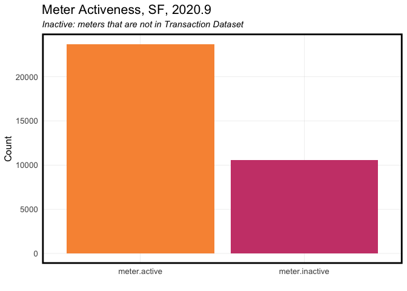


### 2.2 Creating Parking Time Panel

In this project, time-space model is used to predict parking, thus, `parking.time.panel` is created with a time interval of ONE HOUR. Considering the use case - predictive parking rates, shorter time interval is unnecessary.


### 2.3 Processing Parking Time Panel


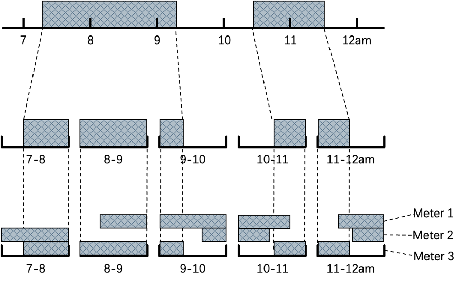

The dependent variable of our model is the **parking time at each street segment**. 

First, we downloaded the parking transaction data that has the time length for each transaction at each parking meter in SF in September. We cut the time length into the one-hour time interval of every hour; for example, if one transaction started at 9:10 am and ended at 10:20 am, we divided this transaction into 50 minutes in the 9 am interval and 20 minutes in the 10 am interval. 

We then aggregated the meter-level data to street segment level data according to the street segment ID of each meter; for instance, if one street segment has ten meters and each meter was occupied for 10 minutes from 9 am to 10 am, then this street segment has a parking time of 100 minutes in the 9 am interval and the hourly maximum parking capacity is 10*60=600 minutes for this street segment. We assign each street segment with geometry from the on-street parking census of SF. We use the street-segment-level parking time in the following analysis and modeling.

Python is used to accelerate this process.

### 2.4 Loading Processed Parking Time Panel

### 2.5 Loading Parking Census Data


For independent variables, we include parking data such as the number of parking spaces on each street segment from DataSF, weather data from riem, amenity data from OpenStreetMap, and other variables that we create through feature engineering. More details of independent variables will be discussed in later sections.

Data Source: 

https://data.sfgov.org/Transportation/On-Street-Parking-Census/9ivs-nf5y

### 2.6 City Amenities Data


Data Source: 

https://data.sfgov.org/Transportation/Muni-Stops/i28k-bkz6

https://data.sfgov.org/Transportation/Map-of-Parking-Regulations/qbyz-te2i

https://data.sfgov.org/Culture-and-Recreation/Recreation-and-Parks-Properties/gtr9-ntp6

https://data.sfgov.org/Culture-and-Recreation/Cultural-Districts/5xmc-5bjj

### 2.7 OSM data


Data Source: 

https://www.openstreetmap.org/

### 2.8 Adding Time Lag + Time Dummy


To regress on space/time model, time lag from one hour to one week is included as predictors. They will be tested later to see their correlation with dependent variable.

### 2.9 Weather


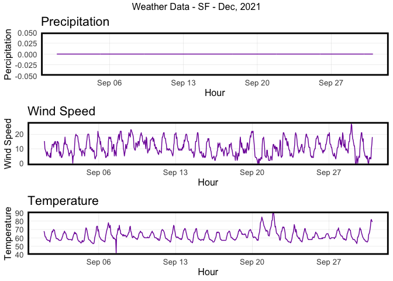

Because of the Mediterranean climate, San Francisco is very dry in Sep, thus, precipitation can hardly be a predictor, leaving us other weather predictors - wind speed and temperature.


## 3. Exploratory Analysis

### 3.1 Time Process of Depandent Variable


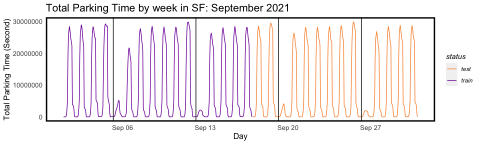

Aggregated dependent variable-total parking time shows obvious periodic characteristics. It is conceivable that time lag will become very good predictors.

In the unit of one week, the distribution of total parking time in each week is have the same trends. Due to San Francisco’s free parking policy on Sundays, the total parking time on Sundays is significantly less, and there are more parking from Monday to Friday with a slight increase trend.

In the unit of one day, the total parking time always peaks at a certain moment of the day, and reaches a low point (about 0) in the early morning and late night. Again, this is related to free parking in the evening in San Francisco.

The whole dataset is divided into Train-set(3-week) and Test-set(2-week).


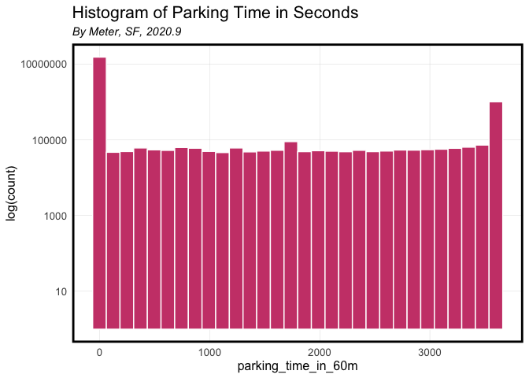
In the time-panel with one-hour intervals, the parking time presents such a trend: a very large number of 0 (no parking), a large number of 3600 (a full hour of parking) and a small number of others (less than 3600s of paking in the hour). This figure shows the reason why it is a bad idea to predict on a single meter instead on a whole street segment. Such an irregular distribution is difficult to transform into effective information in a model.


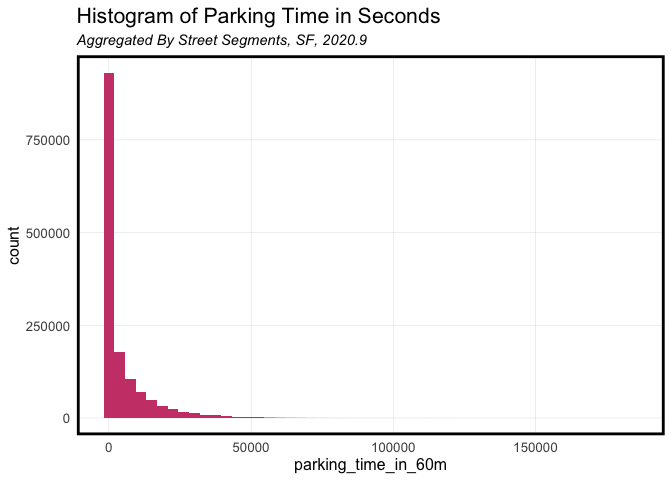

Aggregating dependent variable by street segments, this figure shows that there are plenty of empty streets (or not recorded parking) in SF. And there are few streets with parking time more than 50,000 seconds in an hour. The distribution of dependent variable is pretty similar to Poisson Distribution, thus, a Poisson Regression is included except for OLS.

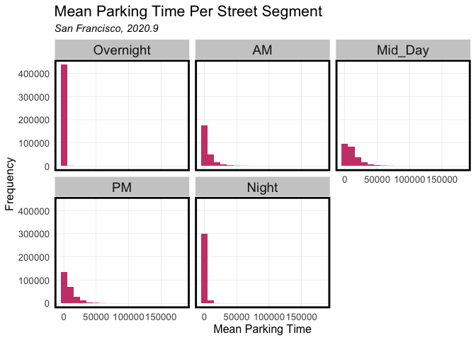

As mentioned before, in `mid_day`, San Francisco recorded longer parking times, followed by `am` and `pm.` In the early morning and late night, almost no parking was recorded.


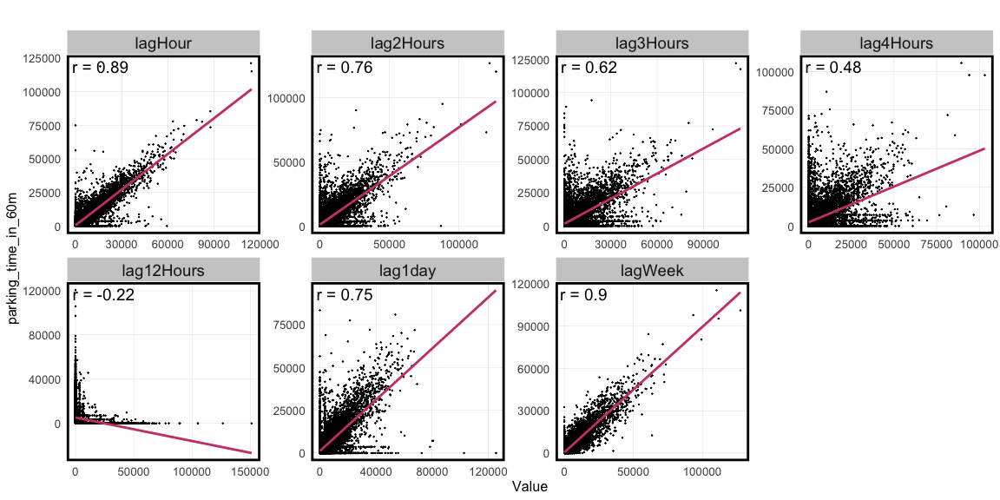


Next, the time lag features are tested for correlation with dependent variable. 

It is obvious that most time lag variables have a very high correlation with the dependent variable. `laghour` and `lagweek` are variables that are more related to the dependent variable, and their R^2 are 0.89 and 0.9, respectively. Followed by lag2hour, lag1day, lag3hour, and lag4hour, their R^2 are 0.76, 0.75, 0.62, and 0.48, respectively. The opposite is lag12Hours. Since night parking is not recorded, lag12hour is negatively correlated with the dependent variable.

Due to too small correlation, lag12hours will be removed from predictors. In addition, because of limited size of the data set, Lagweek, which will significantly reduce the size of training set and test set, is also removed.


### 3.2 Spatial Process of Depandent Variable


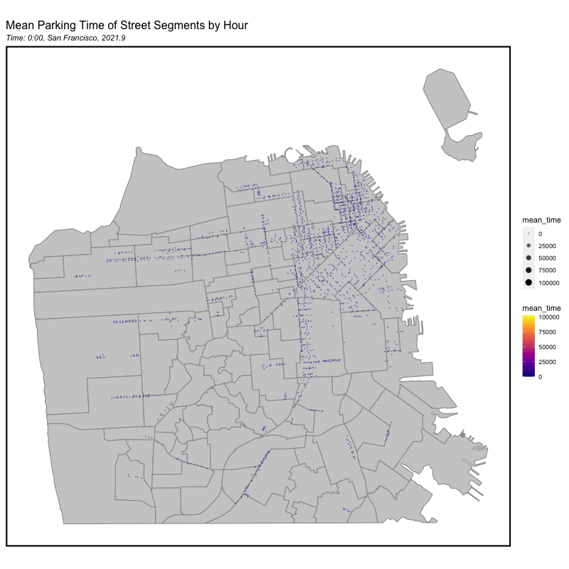

The figure above is the temporal/spatial process of average parking time within a day. It can be seen that there is clustering in parking time around noon, and it is near the Union square in downtown San Francisco. Therefore, predictors related to spatial processes are necessary.


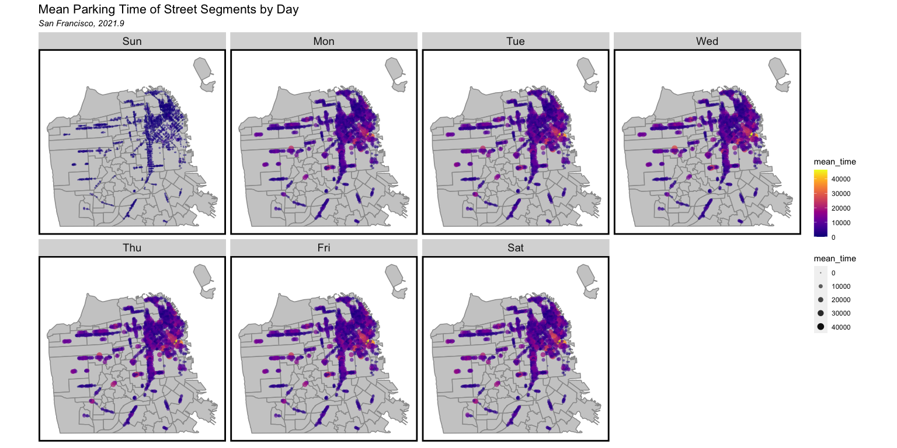

Within a week, the change in parking time is limited. The most notable thing is the comparison between Sunday and other times. From Monday to Saturday, similar to the previous figure, there are longer parking times in the area near the city center.


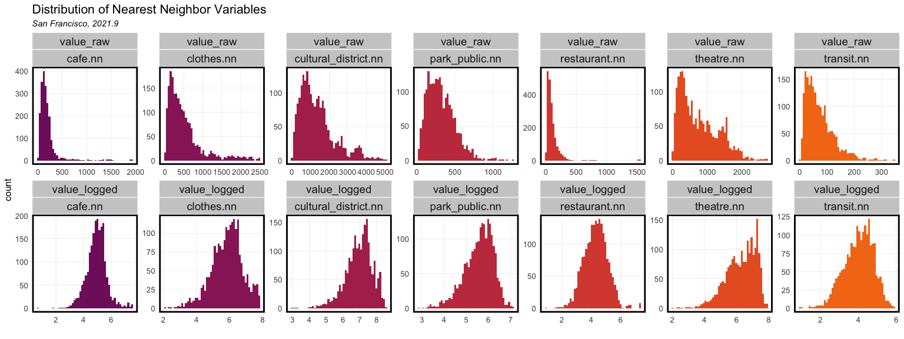

Nearest neighbor variables are introduced to explain the spatial process. Amenities like transit station, public parks are downloaded, and the distance to the nearest neighbors are collected to be the predictors. And they are log transformed to avoid the negative effect of skewness.


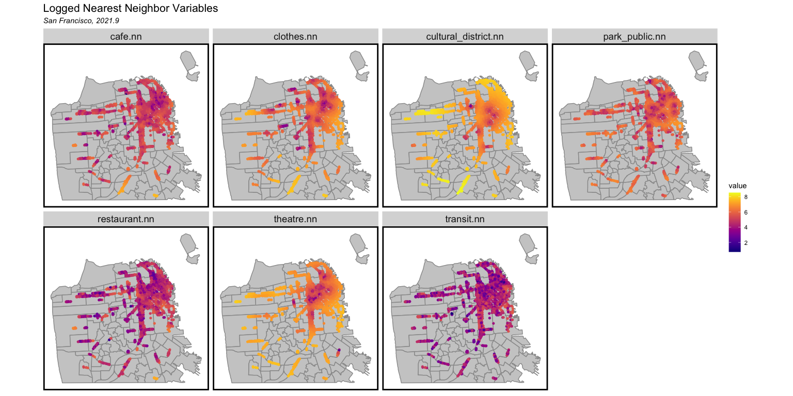


Spatial Correlation


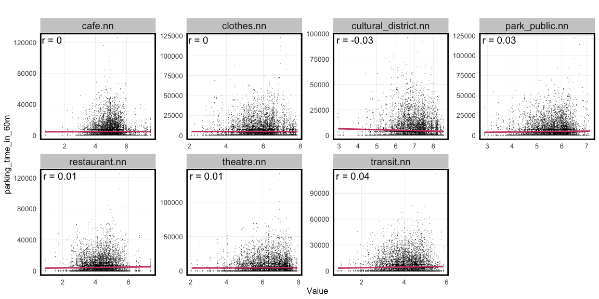

Despite the preprocessing, these spatial variables have limited correlation with the dependent variable. One possible reason is that the distribution of the dependent variable is not a normal distribution, and a large number of zero values affect the linear relationship between the spatial variables and the dependent variable.

Nevertheless, we still retain these spatial variables in some models to compare with the baseline model.


## 4. Modeling 

Following is a detailed description of independent variables:

`spots_num_census`: the total number of parking spaces on this street segment

`lagHour`: the parking time on this street segment one hour ago

`lag2Hours`: the parking time on this street segment two hours ago

`lag3Hours`: the parking time on this street segment three hours ago

`lag4Hours`: the parking time on this street segment four hours ago

`lag1day`: the parking time on this street segment one day ago

`week`: which day the parking happened

`hour`: what hour the parking happened

`transit.nn`: the log of the distance from the street segment to the nearest transit station

`park_public.nn` : the log of the distance from the street segment to the nearest public park

`cultural_district.nn`: the log of the distance from the street segment to the nearest cultural district

`restaurant.nn`: the log of the average distance from the street segment to the nearest three restaurants

`cafe.nn`: the log of the average distance from the street segment to the nearest three cafes

`theatre.nn`: the log of the average distance from the street segment to the nearest three theatres

`clothes.nn`: the log of the average distance from the street segment to the nearest three clothes stores

`Temperature`: the temperature of the hour when parking happened

`Wind_Speed`: the wind speed of the hour when parking happened


We first developed 4 linear regression models to predict the parking demand in SF with different combinations of independent variables as shown below:

Weather_Time Model: Parking spaces counts, Weather, Time
Space_Time Model: Parking spaces counts, Weather, Time, Distance to amenities
Lag_Time Model: Parking spaces counts, Weather, Time, Time lags
Time_Space_Lag_Weather Model: Parking spaces counts, Weather, Time, Distance to amenities, Time lags

Because the distribution of our dependent variable is more similar to Poisson distribution rather than normal distribution, we also use the variable selection from the Time_Space_Lag_Weather Model to develop a Poisson regression model.

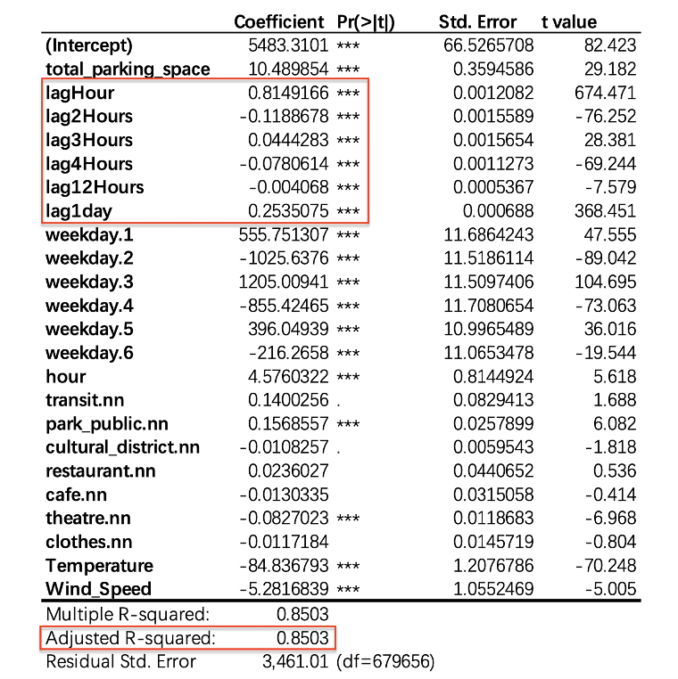

The overall quality of the Space Time Lag Weather Model is satisfying. The adjusted R-squared is 0.85, which means that 85% of the variance in the dependent variable, parking time, is explained by the model. And as is mentioned before, these six time lag variables are significent in the model.


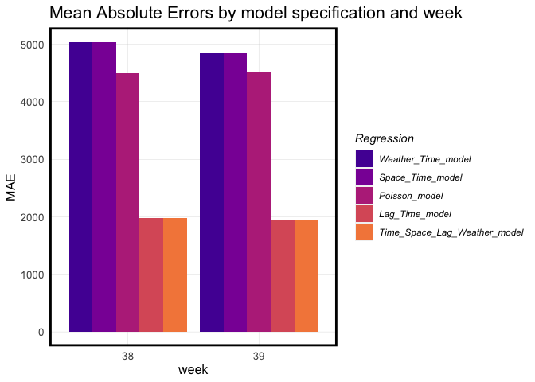

Comparing all five models, in terms of accuracy, the last two models with time lag variables performs better than any other models, having a MAE of less than 2000 seconds (33minutes) per street. The Poisson model is not as good as expected. And the models with space variables barely make a difference.


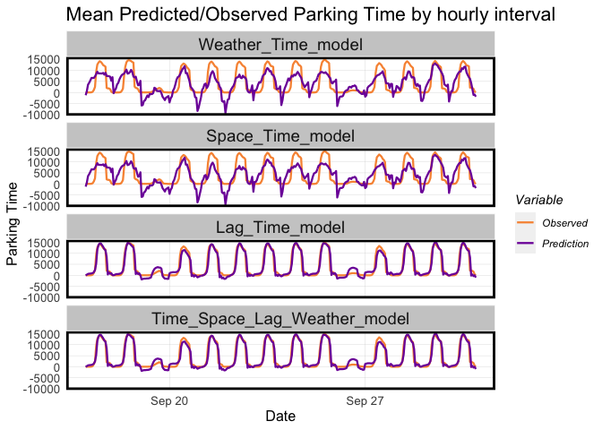

Again, the models with time variables perfectly predicts the parking time. They are able to predict every peak and trough in the observations. In terms of generalizability, it may be worrying because there is some overfitting here, but in our use case, not generalizability but accuracy is what we care about.

## 5. Cross Validation

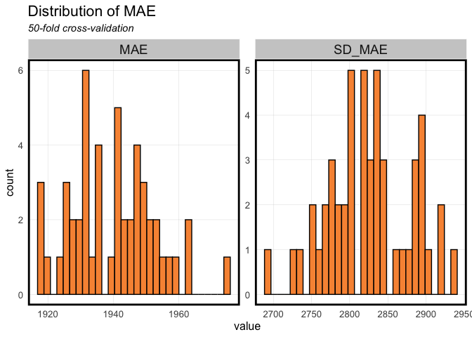

The cross-validation gets MAE of about 1940 seconds (32min) per street, which means the error is only half an hour of all meters per street segment. So the generalizability of the model is actually not bad.

## 6. Additional Visualizations


We also want to see whether the prediction of this model can actually decide the parking rate changes correctly. So we used parking rate change data from SFMTA. However, the dataset does not contain geometry columns, so we have to geocoded it, and may introduce errors.

According to SFMTA, they raises the rate by \$0.25 on blocks where average occupancy is above 80%, lowers the rate \$0.25 on blocks where average occupancy is below 60%, and does not change the rate on blocks that hit the target occupancy between 60% and 80%. Rates vary by block, by time of day, and weekday or weekend.

Data Source: https://www.sfmta.com/reports/2021-parking-meter-rate-adjustments


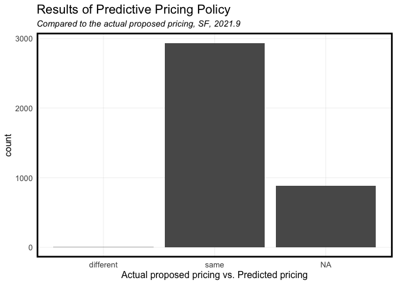

As is shown in the plot, except for the NA (meter cannot be found in the dataset), the results of the prediction is great... TOO great. It turns out that almost all the streets have an occupancy less than 60%. It is either because parking lots are more than enough in SF, or the parking fee is too high compared to offstreet parking. Thus, all the meters need a depreciation, but few of them can actually do that because of the price reduction standard - "Minimum rate rule" of \$0.25 or "Meter payment realization rate threshold applied".

## 7. Discussion

### 7.1 Use Case

We have developed a good model that predicts the future parking demand based on history data of parking. Our model can explain 85% of the variation of the independent variable. Our model also has a satisfying good of fitness and a decent generalizability. With the predicted parking demand in the form of parking time, we can calculate the predicted occupancy rate of each street segment without the necessity of installing real-time sensors. We can then set and adjust parking prices that rise whenever the predicted occupancy rate exceeds the threshold of 80%. Our model has a satisfying good of fitness and a decent generalizability. Thus, users can use our model to determine on-street parking rates that fit the policy of demand-responsive parking while saving their budget.

### 7.2 Limitations

1. The assumption of OLS - linear relationship between dependent variable and each of the predictors is violated. There is some non-linear relationship between spatial variables and the dependent variable. A polynomial model or other non-linear model may help to address this problem.

2. The parking fee dataset is not perfectly available online, thus, we cannot include the parking fee as on of the predictors, which could be a great predictor of parking time.


## 8. Codes

```r
knitr::opts_chunk$set(
	message = FALSE,
	warning = FALSE,
	results=FALSE,
	fig.align="center",
	cache=T
)
```


```r
library(tidyverse)
library(tidycensus)
library(sf)
library(kableExtra)
library(patchwork)
library(ggplot2)
library(viridis)
library(gridExtra)
library(knitr)
library(lubridate)
library(riem)
library(osmdata)
library(gganimate)
library(hms)
library(gifski)
library(caret)

library(stargazer)

options(scipen=999)
options(tigris_class = "sf")
options(tigris_use_cache = TRUE)
source("functions.r")

p5 = viridis::plasma(5)
p2 = p5[c(4,2)]

v = mapview::mapview

# NAD83(2011) / San Francisco CS13
crs = 7131
```


```r
meter_trans = read.csv("./data/meter_trans_2021-09.csv")%>%
  mutate(
    interval60 = floor_date(ymd_hms(session_start_dt), unit = "hour"),
    # week = week(interval60),
    # dotw = wday(interval60, label=TRUE),
    parking_time = as.numeric(ymd_hms(session_end_dt)-ymd_hms(session_start_dt)))%>%
  filter(parking_time>0)

meters = st_read("./data/Parking Meters.geojson")%>%
  select(post_id, ms_space_num, on_offstreet_type, active_meter_flag, meter_type,
         street_id, street_seg_ctrln_id, longitude, latitude, geometry)%>%
  st_transform(crs)%>%
  mutate(
    street_seg_ctrln_id = street_seg_ctrln_id%>%as.numeric()%>%as.character(),
    ms_space_num = as.numeric(ms_space_num),
    ms_space_num = if_else(ms_space_num==0,1,ms_space_num)
  )

sf_neighborhood <-st_read("./data/SF Find Neighborhoods.geojson")%>%
  st_transform('EPSG:7131')
```


```r
meter.inactive = setdiff(unique(meters$post_id),unique(meter_trans$post_id))%>%length()
meter.intersection = intersect(unique(meters$post_id),unique(meter_trans$post_id))%>%length()
data.frame("meter.inactive"=meter.inactive,
           "meter.active"=meter.intersection)%>%
  gather()%>%
  ggplot(aes(key,value))+
    geom_col(fill=p5[3:4])+
    plotTheme()+
    labs(title="Meter Activeness, SF, 2020.9",
         subtitle = 'Inactive: meters that are not in Transaction Dataset',
         x="", y ="Count")
```


```r
parking.time.panel =
  expand.grid(interval60 = unique(weather.Panel$interval60), 
              post_id = unique(meter_trans$post_id))%>%
  mutate(parking_time_in_60m = 0,
         index = row_number())
```


```r
parking.time.panel = read.csv("./data/parking_spot_panel.csv")

parking.time.panel.sum = parking.time.panel%>%
  left_join(meters%>%st_drop_geometry()%>%
      select(street_seg_ctrln_id,post_id), by = "post_id")%>%
  group_by(street_seg_ctrln_id,interval60)%>%
  summarise(parking_time_in_60m = sum(parking_time_in_60m))
parking.time.panel.sum

# parking.time.panel.sum%>%
#   group_by(interval60)%>%
#   summarise(parking_time_in_60m = sum(parking_time_in_60m))%>%
#   ggplot()+
#     geom_col(aes(ymd_hms(interval60),parking_time_in_60m))

parking.time.panel.sum<-
  parking.time.panel.sum%>%
mutate(week = week(interval60),
       dotw = wday(interval60, label=TRUE))

parking.time.panel.sum<-
  parking.time.panel.sum%>%
  mutate(status = ifelse(week <= 37, "train", "test"))

sundays <- 
  mutate(parking.time.panel.sum,
         sunday = ifelse(dotw == "Sun" & hour(interval60) == 1,
                         interval60, 0)) %>%
  filter(sunday != 0)

sundays <-
  sundays%>%
  mutate(sunday = as.POSIXct(sunday))
```


```r
parking_census <- read.csv("data/On-Street_Parking_Census.csv")%>%
  select(CNN, PRKG_SPLY)
parking_census$CNN <- as.character(parking_census$CNN)

parking_seg_census <- meters%>%
  select(street_seg_ctrln_id, geometry)%>%
  distinct(street_seg_ctrln_id, .keep_all = T)

parking_seg_census <- parking_seg_census%>%
  left_join(parking_census, by = c("street_seg_ctrln_id"="CNN"))%>%
  drop_na(PRKG_SPLY)%>%
  rename(spots_num_census = PRKG_SPLY)

# off_parking_census <- read.csv("data/SFMTA_Managed_Off-street_Parking.csv")%>%
#   select(STREET_SEG_CTRLN_ID, CAPACITY)
```


```r
transit <- st_read("data/Muni Stops.geojson")%>%
  st_transform(crs)

park_public <- st_read("data/Recreation and Parks Properties.geojson")%>%
  st_transform(crs)%>%
  select(propertytype, geometry)%>%
  rename(type=propertytype)

park_private <- st_read("data/Privately Owned Public Open Spaces.geojson")%>%
  st_transform(crs)%>%
  select(type, geometry)

cultural_district <- st_read("data/Cultural Districts.geojson")%>%
  st_transform(crs)

st_c = st_coordinates
parking_seg_census <-
  parking_seg_census %>%
  mutate(
    transit.nn =
      nn_function(st_c(parking_seg_census), st_c(transit),1),
    park_public.nn =
      nn_function(st_c(parking_seg_census), st_c(st_centroid(park_public)),1),
    cultural_district.nn =
      nn_function(st_c(parking_seg_census), st_c(st_centroid(cultural_district)),1))
```


```r
## OSM Data

sf_boundary <- st_read("data/Bay Area Counties.geojson")%>%
  filter(county == "San Francisco")%>%
  st_transform(crs)%>%
  select(geometry)

q0 <- osmdata::opq(bbox = c(-122.3505,37.7025,-122.5171,37.8364)) 

restaurant <- add_osm_feature(opq = q0, key = 'amenity', value = "restaurant") %>%
  osmdata_sf(.)
restaurant.sf <- st_geometry(restaurant$osm_points) %>%
  st_transform(4326) %>%
  st_sf() %>%
  cbind(., restaurant$osm_points$amenity) %>%
  rename(NAME = restaurant.osm_points.amenity)%>%
  st_transform(crs)%>%
  st_intersection(sf_boundary)%>%
  dplyr::select(geometry)%>%
  distinct()

theatre <- add_osm_feature(opq = q0, key = 'amenity', value = "theatre") %>%
  osmdata_sf(.)
theatre.sf <- st_geometry(theatre$osm_points) %>%
  st_transform(4326) %>%
  st_sf() %>%
  cbind(., theatre$osm_points$amenity) %>%
  rename(NAME = theatre.osm_points.amenity)%>%
  st_transform('EPSG:7131')%>%
  st_intersection(sf_boundary)%>%
  dplyr::select(geometry)%>%
  distinct()

cafe <- add_osm_feature(opq = q0, key = 'amenity', value = "cafe") %>%
  osmdata_sf(.)
cafe.sf <- st_geometry(cafe$osm_points) %>%
  st_transform(4326) %>%
  st_sf() %>%
  cbind(., cafe$osm_points$amenity) %>%
  rename(NAME = cafe.osm_points.amenity)%>%
  st_transform('EPSG:7131')%>%
  st_intersection(sf_boundary)%>%
  dplyr::select(geometry)%>%
  distinct()

clothes <- add_osm_feature(opq = q0, key = 'shop', value = "clothes") %>%
  osmdata_sf(.)
clothes.sf <- st_geometry(clothes$osm_points) %>%
  st_transform(4326) %>%
  st_sf() %>%
  cbind(., clothes$osm_points$shop) %>%
  rename(NAME = clothes.osm_points.shop)%>%
  st_transform('EPSG:7131')%>%
  st_intersection(sf_boundary)%>%
  dplyr::select(geometry)%>%
  distinct()

parking_seg_census <-
  parking_seg_census %>%
  mutate(
    restaurant.nn =
      nn_function(st_c(parking_seg_census), st_c(restaurant.sf),3),
    cafe.nn =
      nn_function(st_c(parking_seg_census), st_c(cafe.sf),3),
    theatre.nn =
      nn_function(st_c(parking_seg_census), st_c(theatre.sf),3),
    clothes.nn =
      nn_function(st_c(parking_seg_census), st_c(clothes.sf),3))

park.engineer = parking.time.panel.sum%>%
  left_join(
    parking_seg_census%>%
      # log all the nn vars
      mutate_at(ends_with(".nn")%>%vars()%>%all_of(),log),
    by="street_seg_ctrln_id")
```


```r
park.engineer = park.engineer%>%
  rename(street.id = street_seg_ctrln_id)%>%
  group_by(street.id) %>% 
  mutate(lagHour = dplyr::lag(parking_time_in_60m,1),
         lag2Hours = dplyr::lag(parking_time_in_60m,2),
         lag3Hours = dplyr::lag(parking_time_in_60m,3),
         lag4Hours = dplyr::lag(parking_time_in_60m,4),
         lag12Hours = dplyr::lag(parking_time_in_60m,12),
         lag1day = dplyr::lag(parking_time_in_60m,24),
         lagWeek = dplyr::lag(parking_time_in_60m,24*7),
         week = interval60%>%week,
         weekday = interval60%>%wday(T),
         is.weekend = interval60%>%wday(week_start=1)>=6,
         hour = interval60%>%hour()) %>% 
 ungroup()
```


```r
weather.SF <- 
  riem_measures(station = "SFO", date_start = "2021-09-01", date_end = "2021-10-01")

weather.Panel <-  
  weather.SF %>%
  mutate_if(is.character, list(~replace(as.character(.), is.na(.), "0"))) %>% 
  replace(is.na(.), 0) %>%
  mutate(interval60 = ymd_h(substr(valid, 1, 13))) %>%
  mutate(week = week(interval60),
         dotw = wday(interval60, label=TRUE)) %>%
  group_by(interval60) %>%
  summarize(Temperature = max(tmpf),
            Percipitation = sum(p01i),
            Wind_Speed = max(sknt)) %>%
  mutate(Temperature = ifelse(Temperature == 0, 42, Temperature))

grid.arrange(top = "Weather Data - SF - Dec, 2021",
  ggplot(weather.Panel, aes(interval60,Percipitation)) + geom_line(color=p5[2]) + 
    labs(title="Precipitation", x="Hour", y="Percipitation") + plotTheme(),
  ggplot(weather.Panel, aes(interval60,Wind_Speed)) + geom_line(color=p5[2]) + 
    labs(title="Wind Speed", x="Hour", y="Wind Speed") + plotTheme(),
  ggplot(weather.Panel, aes(interval60,Temperature)) + geom_line(color=p5[2]) + 
    labs(title="Temperature", x="Hour", y="Temperature") + plotTheme())
```


```python
"""
The function below is used to union the parking time windows of each meter 
and split the time windows into its panel.

[Input]    meterTrans: pd.DataFrame
[Output] parkTimePanel: numpy.array[sympy.Interval[datetime.datetime, datetime.datetime]]
                        (each array element is a parking interval)
"""

for rowNumber in range(meterTrans.shape[0]):
    start_time_rounded = meterTrans.loc[rowNumber, "interval60"]
    start_time = meterTrans.loc[rowNumber, "session_start_dt"].timestamp()
    end_time = meterTrans.loc[rowNumber, "session_end_dt"].timestamp()
    post_id_row = meterTrans.loc[rowNumber, "post_id"]

    while start_time<end_time:
      # get the last minute of this hour
      this_end = min(end_time, start_time + 3600 - start_time%3600)
      this_interval = [start_time, this_end]
      # find the index of this hour and this meter in the meter panel
      index = meterPanel.loc[(post_id_row,start_time_rounded),"rownum"]
      # union the time window
      u = union(array[index], this_interval)
      parkTimePanel[index]=u
      # if parking time > 1hr, continue to the next hour
      start_time_rounded += onehour
      start_time = this_end
```


```r
park.engineer = park.engineer%>%
  mutate(interval60 = ymd_hms(interval60))%>%
  left_join(weather.Panel,by="interval60")%>%
  drop_na(Temperature) # to remove data on OCT.01
```


```r
parking.time.panel.sum%>%
  filter(interval60>= "2021-09-01 00:00:00" & interval60 <= "2021-09-30 23:59:59")%>%
  group_by(interval60, status)%>%
  summarise(parking_time_in_60m = sum(parking_time_in_60m))%>%
  ggplot(aes(ymd_hms(interval60),parking_time_in_60m, colour = status))+
    geom_line()+
  geom_vline(data = sundays, aes(xintercept = sunday))+
  scale_colour_manual(values = p2)+
  labs(title="Total Parking Time by week in SF: September 2021",
       x="Day", y="Total Parking Time (Second)") +
  plotTheme() + theme(panel.grid.major = element_blank())
```


```r
parking.time.panel %>% 
  ggplot(aes(parking_time_in_60m))+
    geom_histogram(bins=30, fill = p5[3], color="white") +
    plotTheme()+
    scale_y_log10()+
    labs(title="Histogram of Parking Time in Seconds",
         subtitle = 'By Meter, SF, 2020.9', y='log(count)')
```


```r
park.engineer %>% 
  select(parking_time_in_60m) %>% 
  ggplot(aes(parking_time_in_60m))+
    geom_histogram(bins=50, fill = p5[3]) +
    plotTheme()+
    labs(title="Histogram of Parking Time in Seconds",
         subtitle = 'Aggregated By Street Segments, SF, 2020.9')
```


```r
int.ampeak <- interval(as_hms("07:00:00"),as_hms("10:00:00"))
int.pmpeak <- interval(as_hms("15:00:00"),as_hms("18:00:00"))
int.midday <- interval(as_hms("10:00:00"),as_hms("15:00:00"))
int.night <- interval(as_hms("18:00:00"),as_hms("23:00:00"))
int.overnight <- interval(as_hms("00:00:00"),as_hms("07:00:00"))

parking.time.panel.sum <-parking.time.panel.sum%>%
  mutate(period = case_when(ymd_hms(paste0('1970-01-01',str_sub(interval60, 12)))%within% int.ampeak ~ "AM",
                            ymd_hms(paste0('1970-01-01',str_sub(interval60, 12)))%within% int.pmpeak ~ "PM",
                            ymd_hms(paste0('1970-01-01',str_sub(interval60, 12)))%within% int.midday ~ "Mid_Day",
                            ymd_hms(paste0('1970-01-01',str_sub(interval60, 12)))%within% int.night ~ "Night",
                            ymd_hms(paste0('1970-01-01',str_sub(interval60, 12)))%within% int.overnight ~ "Overnight"))


parking.time.panel.sum %>%
  mutate(across(period, factor, levels=c("Overnight","AM","Mid_Day","PM","Night"))) %>%
  group_by(interval60, street_seg_ctrln_id, period) %>%
  summarize(mean_time = mean(parking_time_in_60m))%>%
  ggplot()+
  geom_histogram(aes(mean_time), binwidth = 10000, fill=p5[3])+
  labs(title="Mean Parking Time Per Street Segment",
       subtitle="San Francisco, 2020.9",
       x="Mean Parking Time", 
       y="Frequency")+
  facet_wrap(~period)+
  plotTheme()
```


```r
plotData.lag <-
  as.data.frame(park.engineer)%>%
  dplyr::select(starts_with("lag"), parking_time_in_60m) %>%
  gather(Variable, Value, -parking_time_in_60m) %>%
  mutate(Variable = fct_relevel(Variable, "lagHour","lag2Hours","lag3Hours",
                                "lag4Hours","lag12Hours","lag1day"))
correlation.lag <-
  group_by(plotData.lag, Variable) %>%
  summarize(correlation = round(cor(Value, parking_time_in_60m, use = "complete.obs"), 2))

plotData.lag%>%sample_n(100000)%>%
ggplot(aes(Value, parking_time_in_60m)) +
  geom_point(size = 0.1) +
  geom_text(data = correlation.lag, 
            aes(label = paste("r =", round(correlation, 2))),
            x=-Inf, y=Inf, vjust = 1.5, hjust = -.1,size=5) +
  geom_smooth(method = "lm", se = FALSE, colour = p5[3]) +
  facet_wrap(~Variable, nrow = 2, scales = "free") +
  labs(title = "") +
  plotTheme()
```


```r
park.engineer <-park.engineer%>%
  mutate(time_period = case_when(ymd_hms(paste0('1970-01-01',str_sub(interval60, 12)))%within% int.ampeak ~ "AM",
                            ymd_hms(paste0('1970-01-01',str_sub(interval60, 12)))%within% int.pmpeak ~ "PM",
                            ymd_hms(paste0('1970-01-01',str_sub(interval60, 12)))%within% int.midday ~ "Mid_Day",
                            ymd_hms(paste0('1970-01-01',str_sub(interval60, 12)))%within% int.night ~ "Night",
                            ymd_hms(paste0('1970-01-01',str_sub(interval60, 12)))%within% int.overnight ~ "Overnight"))


park.engineer.map = park.engineer %>%
  group_by(street.id, hour) %>%
  summarize(mean_time = mean(parking_time_in_60m))%>%
  ungroup()%>%
  left_join(parking_seg_census,by = c("street.id"="street_seg_ctrln_id"))%>%
  st_sf()%>%
  rename(time_hour = hour)
map.lables = qBr(park.engineer.map,"mean_time")

animation =
  ggplot()+
    geom_sf(data = sf_neighborhood, fill="#cccccc", color="#999999")+
    geom_sf(data= park.engineer.map, 
            aes(color=mean_time,size=mean_time,alpha=mean_time),
            stroke = .5, shape = 16)+
    viridis::scale_color_viridis(option = "C")+
    scale_size_continuous(range = c(0.5,4))+
    scale_alpha_continuous(range = c(0.5,1))+
    transition_manual(time_hour) +
    labs(title="Mean Parking Time of Street Segments by Hour",
         subtitle = "Time: {current_frame}:00, San Francisco, 2021.9")+
    mapTheme()

# animate(animation, duration=20, renderer = gifski_renderer())
anim_save("./pic/ani.gif", height = 800, width =800, animation, duration=4, renderer = gifski_renderer())
```


```r
park.engineer.map = park.engineer %>%
  group_by(street.id, dotw) %>%
  summarize(mean_time = mean(parking_time_in_60m))%>%
  ungroup()%>%
  left_join(parking_seg_census,by = c("street.id"="street_seg_ctrln_id"))%>%
  st_sf()

map.lables = qBr(park.engineer.map,"mean_time")

ggplot()+
  geom_sf(data = sf_neighborhood, fill="#cccccc", color="#999999")+
  geom_sf(data= park.engineer.map, 
          aes(color=mean_time,size=mean_time,alpha=mean_time),
          stroke = .5, shape = 16)+
  viridis::scale_color_viridis(option = "C")+
  scale_size_continuous(range = c(0.5,4))+
  scale_alpha_continuous(range = c(0.5,1))+
  facet_wrap(~dotw,nrow=2) +
  labs(title="Mean Parking Time of Street Segments by Day",
       subtitle = "San Francisco, 2021.9")+
  mapTheme()
```


```r
parking_seg_census%>%
  pivot_longer(cols=ends_with(".nn"),names_to="name1",values_to="value_raw")%>%
  mutate(value_logged = log(value_raw))%>%
  pivot_longer(cols=starts_with("value"),names_to="if_log",values_to="name_log")%>%
  mutate(across(if_log, factor, levels=c("value_raw","value_logged"))) %>%
  ggplot()+
    geom_histogram(aes(name_log,fill=name1),bins=50)+
    scale_fill_manual(values=inferno(18)[7:13],guide=F)+
    facet_wrap(if_log~name1,scales = "free",nrow=2)+
    plotTheme()+
    labs(title='Distribution of Nearest Neighbor Variables',
         subtitle = 'San Francisco, 2021.9', x="")
```


```r
mapdata = parking_seg_census%>%
  select(-spots_num_census,-street_seg_ctrln_id) %>% 
  mutate_at(ends_with(".nn")%>%vars()%>%all_of(),log) %>% 
  pivot_longer(ends_with(".nn"),names_to = "variable") %>% 
  st_sf()

ggplot(mapdata)+
  geom_sf(data = sf_neighborhood, fill="#cccccc", color="#999999")+
  geom_sf(aes(color=value),
          stroke = .5, shape = 16)+
  viridis::scale_color_viridis(option = "C")+
  facet_wrap(~variable,nrow=2) +
  labs(title="Logged Nearest Neighbor Variables",
       subtitle = "San Francisco, 2021.9")+
  mapTheme()
```


```r
plotData.lag <-
  as.data.frame(park.engineer)%>%
  dplyr::select(ends_with("nn"), parking_time_in_60m) %>%
  gather(Variable, Value, -parking_time_in_60m)

correlation.lag <-
  group_by(plotData.lag, Variable) %>%
  summarize(correlation = round(cor(Value, parking_time_in_60m, use = "complete.obs"), 2))

plotData.lag%>%sample_n(100000)%>%
ggplot(aes(Value, parking_time_in_60m)) +
  geom_point(size = 0.1, shape=16, stroke=0.4) +
  geom_text(data = correlation.lag, 
            aes(label = paste("r =", round(correlation, 2))),
            x=-Inf, y=Inf, vjust = 1.5, hjust = -.1,size=5) +
  geom_smooth(method = "lm", se = FALSE, colour = p5[3]) +
  facet_wrap(~Variable, nrow = 2, scales = "free") +
  labs(title = "") +
  plotTheme()
```


```r
park.Train = filter(park.engineer, week <= 37) # 35~37
park.Test = filter(park.engineer, week > 37 & week < 40) # 38~39

formula1 = parking_time_in_60m ~ spots_num_census + Temperature+Wind_Speed+weekday+hour

formula2 = parking_time_in_60m ~  spots_num_census + Temperature+Wind_Speed +transit.nn +park_public.nn+park_public.nn+cultural_district.nn+restaurant.nn+cafe.nn+theatre.nn+clothes.nn+weekday+hour

formula3 = parking_time_in_60m ~ spots_num_census + lagHour + lag2Hours+lag3Hours+lag4Hours+lag1day+Temperature+Wind_Speed+weekday+hour

formula4 = parking_time_in_60m ~  spots_num_census + lagHour + lag2Hours+lag3Hours+lag4Hours+lag12Hours+lag1day+weekday+hour+transit.nn +park_public.nn+park_public.nn+cultural_district.nn+restaurant.nn+cafe.nn+theatre.nn+clothes.nn+Temperature+Wind_Speed

reg1 <- lm(formula1, data=park.Train)
reg2 <- lm(formula2, data=park.Train)
reg3 <- lm(formula3, data=park.Train)
reg4 <- lm(formula4, data=park.Train)

reg.pos = glm(formula4, data=park.Train,family = "poisson")
# cost=function(x,y) mean(abs(x-y),na.rm=T)
# reg.pos.cv = boot::cv.glm(park.Train,reg.pos,K=2,cost = cost)

# summary(reg1)
# summary(reg2)
# summary(reg3)
# summary(reg4)
# summary(reg.pos)
```


```r
model_pred <- function(dat, fit){
   pred <- predict(fit, newdata = dat)}

park.Test.weekNest <- 
  as.data.frame(park.Test) %>%
  nest(-week) 

week_predictions <- 
  park.Test.weekNest %>% 
    mutate(Weather_Time_model = map(.x = data, fit = reg1, .f = model_pred),
           Space_Time_model = map(.x = data, fit = reg2, .f = model_pred),
           Lag_Time_model = map(.x = data, fit = reg3, .f = model_pred),
           Time_Space_Lag_Weather_model = map(.x = data, fit = reg4, .f = model_pred),
           Poisson_model = map(.x = data, fit = reg.pos, .f = model_pred))

mean.na = function(x) {mean(x,na.rm=T)}
sd.na = function(x) {sd(x,na.rm=T)}
week_predictions

week_predictions <- week_predictions %>%  
    gather(Regression, Prediction, -data, -week) %>% 
    mutate(Observed = map(data, pull, parking_time_in_60m),
           Absolute_Error = map2(Observed, Prediction,  ~ abs(.x - .y)),
           MAE = map_dbl(Absolute_Error, mean.na),
           sd_AE = map_dbl(Absolute_Error, sd.na))

week_predictions %>%
  dplyr::select(week, Regression, MAE) %>%
  gather(Variable, MAE, -Regression, -week) %>%
  mutate(
    across(Regression,factor,levels=c("Weather_Time_model","Space_Time_model","Poisson_model",
                                    "Lag_Time_model","Time_Space_Lag_Weather_model"))
  )%>%
  ggplot(aes(week%>%as.factor(), MAE)) + 
    geom_bar(aes(fill = Regression), position = "dodge", stat="identity") +
    scale_fill_manual(values = plasma(8)[2:6]) +
    labs(title = "Mean Absolute Errors by model specification and week",x="week") +
  plotTheme()
```


```r
week_predictions %>% 
  mutate(interval60 = map(data, pull, interval60)) %>%
  dplyr::select(interval60, Observed, Prediction, Regression) %>%
  unnest() %>%
  gather(Variable, Value, -Regression, -interval60) %>%
  group_by(Regression, Variable, interval60) %>%
  summarize(Value = mean(Value,na.rm=T)) %>%
  ungroup%>%
  mutate(
    across(Regression,factor,levels=c("Weather_Time_model","Space_Time_model","Poisson_model",
                                      "Lag_Time_model","Time_Space_Lag_Weather_model"))
  )%>%
  filter(Regression!="Poisson_model") %>% 
  ggplot(aes(interval60, Value, colour=Variable)) + 
  geom_line(size = .8) + 
  facet_wrap(~Regression, ncol=1) +
  scale_colour_manual(values = p2) +
  labs(title = "Mean Predicted/Observed Parking Time by hourly interval", 
       x = "Date", y= "Parking Time") +
  plotTheme()
```


```r
# cross-validation
fitControl <- trainControl(method = "cv", number = 50,savePredictions=T)
set.seed(1)
reg.cv = train(formula4, data = park.engineer, 
     method = "lm", trControl = fitControl, na.action = na.pass)
# summary(reg.cv)

# reg.cv <-reg.cv%>%
#   dplyr::select(cvID = street.id, parking_time_in_60m, Prediction)
# 
# reg.summary <- mutate(reg.cv, Error = Prediction - parking_time_in_60m,
#                       Regression = "random k-fold cross validation on the 5 week panel")
```


```r
reg.summary <-reg.cv$pred%>%
  select(foldNum = Resample,pred,obs)%>%
  mutate(AE = abs(pred-obs),
         APE = abs(pred-obs)/obs)%>%
  group_by(foldNum)%>%
  summarise(MAE = mean(AE,na.rm=T),
            SD_MAE = sd(AE,na.rm=T))

reg.summary %>%
  pivot_longer(-foldNum)%>%
  ggplot(aes(value))+
  geom_histogram(colour="black", fill = p5[4])+
  facet_wrap(~name,scale='free')+
  labs(title="Distribution of MAE",
       subtitle = "50-fold cross-validation")+
  plotTheme()
```


```r
fee = st_read("./data/rate.geojson")%>%st_transform(crs)
fee.geom = fee%>%
  group_by(old)%>%
  summarise(geometry2=st_union(geometry)) %>% 
  mutate(geometry2=st_centroid(geometry2)) %>%
  filter(!st_is_empty(.))
  
street.geom = read.csv("data/On-Street_Parking_Census.csv")%>%
  st_as_sf(wkt="shape",crs=4326)%>%
  st_transform(crs) %>% 
  select(street.id = CNN)%>%
  mutate(index = row_number())

nn.result = nngeo::st_nn(fee.geom$geometry2, street.geom$shape,k=1,returnDist=T)

fee.geom = fee.geom%>%mutate(
  nn.index = nn.result$nn%>%as.numeric(),
  nn.distance = nn.result$dist%>%as.numeric(),
) %>% 
  as.data.frame() %>% 
  left_join(street.geom,by=c("nn.index"="index")) %>% 
  st_sf()%>%
  filter(nn.distance<100)

fee.geom$street.id.x%>%unique()%>%length()
fee.geom%>%nrow()
fee.results = fee.geom%>%
  st_drop_geometry() %>% 
  group_by(street.id) %>% 
  summarise(old=first(old)) %>% 
  right_join(fee,by="old")%>% 
  select(
    -streets, -old, -STREET_NAME, -new
  ) %>% 
  drop_na()%>% 
  mutate(rate_change = PROPOSED_RATE - LAST_RATE,
         street.id = as.character(street.id))
```


```r
cv.pred = park.engineer %>%
  mutate(pred =  predict(reg.cv,newdata = .,na.action = na.pass)) %>% 
  drop_na(pred) %>% 
  mutate(time_band = case_when(hour %in% 0:11 ~ "Open-12pm",
                                hour %in% 12:14 ~ "12pm-3pm",
                                hour %in% 15:17 ~ "3pm-6pm",
                                hour %in% 18:24 ~ "6pm-Close"),
         time_band_length = case_when(hour %in% 0:11 ~ 12,
                                hour %in% 12:14 ~ 3,
                                hour %in% 15:17 ~ 3,
                                hour %in% 18:24 ~ 6),
         pred = ifelse(pred<0,0,pred),
         weekday =ifelse(dotw%in%c("Sat","Sun"),"Weekend","Weekday")  ,
         spots_num_census = ifelse(spots_num_census==0,1,spots_num_census))

fee.pred = cv.pred %>% 
  group_by(street.id, weekday, time_band, time_band_length) %>% 
  summarize(mean_occupation = mean(pred)/ spots_num_census/3600/time_band_length) %>% 
  group_by(street.id, weekday, time_band) %>% 
  summarize(pred_occupation = mean(mean_occupation)) %>% 
  mutate(pred_occupation = ifelse(pred_occupation>1,1,pred_occupation),
         pred_rate_change = case_when((pred_occupation>0.8) ~ 0.25,
                                 (pred_occupation>0.6) ~ 0,
                                 (pred_occupation>0)~ -0.25))
  

fee.pred %>% summary()
fee.compare = fee.results %>% 
  select(street.id, weekday=DATE_TYPE, time_band=TIME_BAND, 
         rate_change, actual.occ = OCCUPANCY_PCT) %>% 
  left_join(fee.pred) %>% 
  mutate(is.same = ifelse(rate_change==pred_rate_change,"same","different"))

fee.compare  %>% 
  ggplot(aes(is.same))+
  geom_histogram(stat="count")+
  plotTheme()+
  labs(title="Results of Predictive Pricing Policy",
       subtitle = "Compared to the actual proposed pricing, SF, 2021.9",
       x = "Actual proposed pricing vs. Predicted pricing")
```

